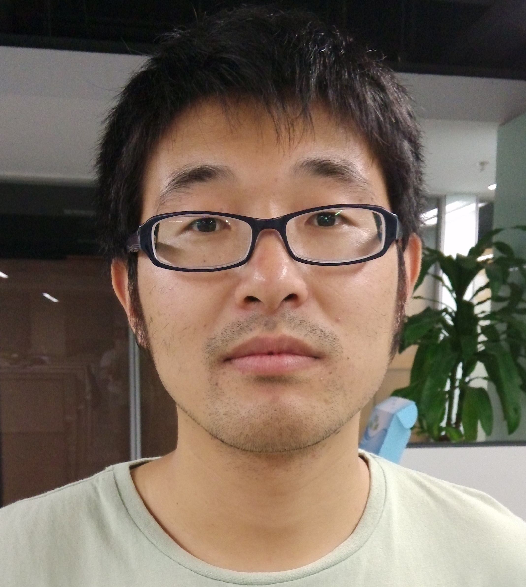

## :four_leaf_clover: Welcome to my homepage!

I am an Associate Research Fellow (Associate Professor) at National Lab of Pattern Recognition, Institute of Automation, Chinese Academy of Sciences (CASIA). I received my Doctor’s degree at CASIA. Before that, I received my Master’s degree of Computer Science from Beijing Institute of Technology (BIT).
