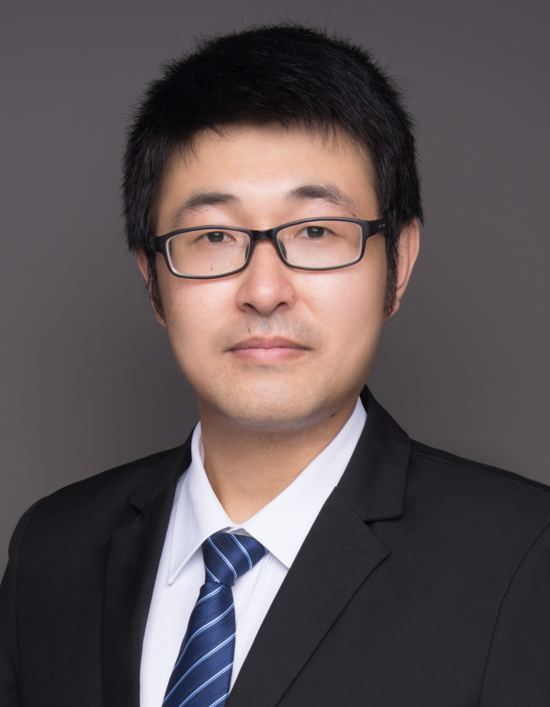

## 👋 Welcome to my homepage!

I am a Professor at National Lab of Pattern Recognition, Institute of Automation, Chinese Academy of Sciences (CASIA). I received my Doctor’s degree at CASIA. Before that, I received my Master’s degree of Computer Science from Beijing Institute of Technology (BIT).
